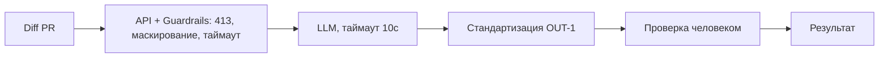

# ADR: решение для первого рабочего сценария

- Статус: proposed
- Дата: 2026-09-10
- Ответственные: команда backend, владелец продукта (допущение)

## Контекст

В учебном PR добавлен endpoint POST /api/reviews и метод ReviewService.review, который отправляет сырой diff во внешний LLM и возвращает свободный текст. По правилам CASE требуется: маскировать секреты (SEC-1), отклонять слишком длинные diff (API-1), ограничивать вызов LLM таймаутом 10 секунд и возвращать контролируемый ответ (REL-1), а также стандартизировать формат результата (OUT-1). Сервис лишь советует и не выполняет действий в GitHub (SCOPE-1).

## Решение

Перед вызовом LLM внедрить слой «guardrails»:
- Проверка длины diff и возврат 413 при >20000 символов (API-1)
- Нормализация и маскирование секретов в diff по известным паттернам (SEC-1)
- Вызов LLM с таймаутом 10 секунд и обработкой ошибок в контролируемый ответ (REL-1)
- Преобразование ответа в структуру OUT-1: `summary`, `risks` (≤3, с `file`, `line`, `evidence`, `risk`), `checks`
Решение не меняет бизнес-логику PR-ревью и не выполняет действий в репозитории. Все риски в ответе подтверждаются diff или правилами (QA-1), в логи не попадает содержимое diff/ответа (OBS-1).

## Рассмотренные альтернативы

| Альтернатива | Почему не выбрали сейчас |
|---|---|
| Полная асинхронная очередь и отложенная обработка | Усложняет первый сценарий; таймаут и контролируемый ответ покрывают основной риск |
| Встроенная аутентификация и квоты | Вне фокуса учебного кейса; не влияет на требуемые правила (допущение) |
| Полная отмена LLM | Теряется ценность помощника; правила позволяют безопасно ограничить риски |

## Последствия и главный риск

- Положительные последствия:
  - Снижение рисков утечек и зависаний, предсказуемый формат ответа
- Ограничения:
  - Возможны ложные срабатывания маскирования; ограничение объёма входа
- Главный риск:
  - Неполное покрытие паттернов секретов или агрессивная редакция ухудшит качество подсказок
- Как проверим риск:
  - Юнит-тесты на маскирование, интеграционные проверки на крайние случаи, e2e сравнение качества выдачи на тестовых diff

## Архитектурная схема

## Как использовали AI

- Для чего: зафиксировать архитектурное решение, следующее из правил CASE и анализа TO BE
- Тип промпта: ADR drafting / structured editing
- Строка в [`prompts.md`](prompts.md): P1-03
- Что проверили и исправили сами: соответствие SEC-1, API-1, REL-1, OUT-1; исключили нерелевантные требования
