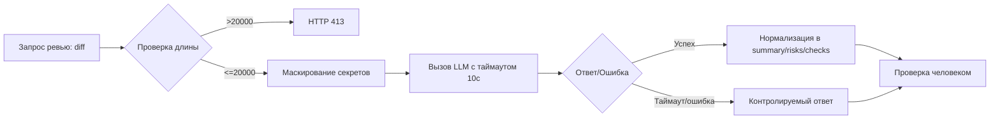

# Анализ процесса: AS IS и TO BE

## AS IS

Ревьюер или CI отправляет diff в POST /api/reviews. Контроллёр без валидации и ограничений извлекает `payload["diff"]` и передаёт как есть в `ReviewService.review`. Сервис формирует prompt строкой `Review this pull request and find problems:\n{diff}` и вызывает `LLM.generate` синхронно. Ответ модели как свободный текст кладётся в поле `comment` и возвращается клиенту. Нет удаления секретов из diff, нет лимита длины, нет таймаута и контролируемого fallback. Логи содержат только базовые технические данные (по правилам), но формат ответа не стандартизирован. app/api.py в diff не содержит валидации схемы входа; аннотация как dict, доступ по ключу без проверки.

## TO BE

Добавляется слой контроля перед LLM: проверка длины diff (413 при > 20000 символов), маскирование секретов, таймаут LLM 10 секунд и обработка ошибок. Ответ стандартизируется по OUT-1: `summary`, `risks` (до 3 с file/line/evidence/risk), `checks`. Сервис остаётся советчиком; решение принимает человек.

## Разница

| Что меняется | AS IS | TO BE | Как проверим изменение |
|---|---|---|---|
| Маскирование секретов (SEC-1) | Сырый diff в prompt | Редакция секретов до вызова LLM | Юнит-тест с мок-LLM фиксирует отсутствие секретов в prompt |
| Лимит длины (API-1) | Нет лимита | 413 для >20000 символов | Интеграционный тест POST с длинным diff |
| Таймаут и fallback (REL-1) | Нет таймаута, зависание/500 | Таймаут 10с и контролируемый ответ | Интеграция с тестовым LLM, задержка >10с |
| Формат ответа (OUT-1) | Свободный текст `comment` | Структура: summary, risks<=3, checks | Снапшот тест ответа |

## Как использовали AI

- Для чего: структурировать AS IS/TO BE и связать изменения с проверками
- Тип промпта: structured editing / master prompt
- Строка в [`prompts.md`](prompts.md): P1-03
- Что проверили и исправили сами: сопоставили TO BE с правилами SEC-1, API-1, REL-1, OUT-1 и TRAINING_PR.diff
