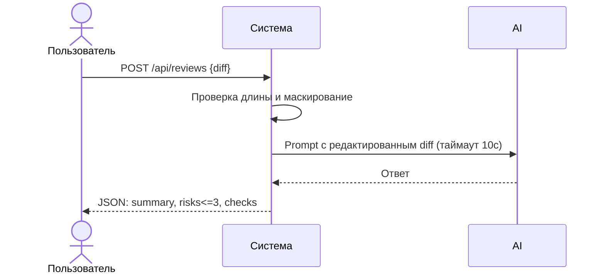

# Use cases и user stories

## Первый рабочий сценарий

**Когда** ревьюер отправляет diff PR в сервис ревью, **система** проверяет размер, маскирует секреты, запрашивает внешний LLM с таймаутом и возвращает структурированные рекомендации, **а пользователь получает** краткое summary, до трёх подтверждённых рисков и список проверок.

Не входит в этот сценарий:

- Автоматический approve/merge, любые изменения кода, аутентификация и квоты (допущение)

## Use case

| Поле | Значение |
|---|---|
| Актор | Инженер-ревьюер или CI |
| Триггер | Поступление diff PR для анализа |
| Предусловия | Доступен endpoint POST /api/reviews; внешний LLM доступен |
| Основной результат | Возвращён JSON со `summary`, `risks` (≤3 с file/line/evidence/risk) и `checks` |
| Ошибка или отказ | Если diff > 20000 символов — 413; при таймауте LLM — контролируемый ответ с описанием ошибки |



## User stories и acceptance criteria

```gherkin
Feature: Ревью PR по diff

  Scenario: Позитивный
    Given доступен endpoint POST /api/reviews
    And внешний LLM отвечает быстрее 10 секунд
    When я отправляю корректный diff длиной 1000 символов
    Then я получаю JSON с полями summary, risks (не больше трёх, с file/line/evidence/risk) и checks
    And risks подтверждены строками diff или правилами

  Scenario: Негативный или граничный — слишком большой diff
    Given доступен endpoint POST /api/reviews
    When я отправляю diff длиной 20001 символ
    Then я получаю статус 413 и описание причины

  Scenario: Негативный — таймаут внешнего LLM
    Given внешний LLM отвечает дольше 10 секунд
    When я запрашиваю ревью
    Then я получаю контролируемый ответ без зависания, пригодный для пользователя
```

## Как использовали AI

- Для чего: сформулировать сценарий, use case и критерии приёма, соответствующие правилам CASE
- Тип промпта: master prompt / structured editing
- Строка в [`prompts.md`](prompts.md): P1-03
- Что проверили и исправили сами: сопоставили поля ответа и ограничения с OUT-1, API-1, REL-1
