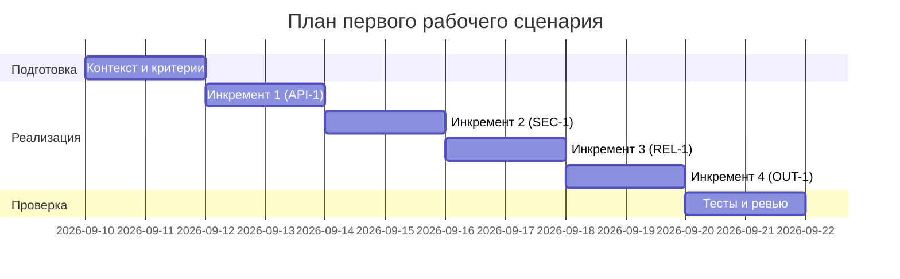

# План поставки

## Инкременты и ответственность

| Инкремент | Наблюдаемый результат | Что делает человек | Что делает AI или субагент | Проверка | Зависимости |
|---|---|---|---|---|---|
| 1 | Контроль длины diff и 413 | Определяет порог и кейсы | Подсказывает шаблоны проверок | Интеграционный тест POST >20000 → 413 | CASE.md API-1 |
| 2 | Маскирование секретов в prompt | Уточняет паттерны и тестовые строки | Генерирует список паттернов и проверок | Юнит-тест mock LLM фиксирует [REDACTED] | CASE.md SEC-1 |
| 3 | Таймаут и контролируемый ответ | Задаёт поведение fallback | Подбирает формулировки ошибок | Интеграция с задержкой >10с → контролируемый ответ | CASE.md REL-1 |
| 4 | Структура ответа по OUT-1 | Описывает schema | Проверяет соответствие | Юнит/интеграция: summary/risks/checks | CASE.md OUT-1 |

## Диаграмма Ганта

Замените даты и задачи на свой план.

## Как использовали AI

- Для чего: наметить инкременты и проверки под правила CASE
- Тип промпта: planning with constraints
- Строка в [`prompts.md`](prompts.md): P1-03
- Что проверили и исправили сами: увязали инкременты с проверками и зависимостями
